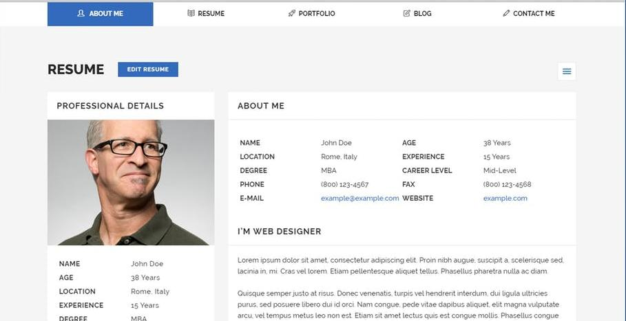

### Assignment Review: Laptop Builder
- Layout
- Styles
- Typescript

---

### Dynamic VS Static

+++

### Static Websites
- Used to show static information
- Unchanging, typically for information display
- e.g https://www.nextacademy.com/

+++

### Dynamic Web Applications
- Used to show dynamic information and functions
- Changes based on information retrieved from an external source
- e.g https://www.airbnb.com/

+++

#### Think of dynamic web apps as a HTML template that can accept variable inputs to change what information is shown

---

### Introduction: Angular
- A Javascript Framework to build dynamic web applications

+++

### A Framework provides:
- sets of tools used to build web applications
- dictates the structure of your web application

+++

### Typical Web Flow


+++

### Angular Flow


---

### Angular Setup
- Node
- npm
- typescript

+++

```
npm install -g @angular/cli

```

---
### Angular Commands
```cli
// Creates the folder and files for a new Angular app
ng new <app-name>

// The following commands must be run within the created app folder
// Starts the Angular Server on port 4200
ng serve
// Creates new folders/files based on a schematic eg: ng generate component ToDoList
ng generate <schematic> <filename>
// HELP
ng <command-name> --help
```

---

### Angular 101: Components

+++

### Components are
- isolated sections of HTML and CSS controlled by JS
- should only store required data and functions
- repeatable

+++

### Components are made of:
- a template (html & css)
- state( JS )

+++

### app.component.ts
```js
@Component({
  selector: 'app-root',
  templateUrl: './app.component.html',
  styleUrls: ['./app.component.scss']
})
export class AppComponent {
  title = 'test-app';
  name = 'default-name'

  onClick(name){
    this.name = name
  }
}
```

---

### Step 1 : Initialize
```
ng generate component NavBarItem
```

+++

This will generate a folder with 4 files
- nav-bar-item.component.ts
- nav-bar-item.component.html
- nav-bar-item.component.css
- nav-bar-item.component.spec.ts (ignore this)

+++

### Step 2 : Create State
```js
class ComponentName {
    stateKey = "State Value"
}
```

+++

### Step 3 : Load Component to view
- put the component element in the `app.component.html`
```html
<component-selector></component-selector>
```

+++

### Step 4 : Use State in template
- use interpolation to load values into template
```html
<div>{{stateKey}}</div>
```

---

### Exercise
- Create components for Resume page



---

### Data Binding
- Kinda like writing javascript code in your attributes

---

### Data Source => View Target
```html

<div [attr.aria-label]="help">Help</div>
<div [class.highlighted]='isHighlighted'></div>
<div [style.color]='hexColor'></div>
```

---

### View Target => Data Source
`component-name.component.html`
```html
<div (click)="onClick()"></div>
```

+++
`component-name.component.ts`
```js
class ComponentName {
    itemName = "Test"

    onClick(){
        this.itemName = "Hello World"
    }
}
```
+++

### Exercise 
- toggle Highlight nav bar item on click 
- toggle text and color on edit resume button (edit resume | save changes)
- trigger alert on click image
- highlight section on hover

---

### Structural Directives

+++

#### Repeating sections *ngFor
```html
<ul>
    <li *ngFor="let task of tasks">
        <p>{{task}}</p>
    </li>
</ul>
```

+++

### Exercise
- use ngFor to repeat repeated sections (i.e label and details)
- highlight different label and values on hover by index

+++

#### Conditional Rendering: *ngIf
```html
<div *ngIf="showText">
    <p>Hello World</p>
</div>
```

+++

### Exercise
- render different pages on clicking different tabs
- toggle rendering nav bar on clicking burger button
- add a button to hide sections of the resume

---
### Exercise: To Do List
- A web application that can:
  - Display list of to do lists
  - Select a to do list and hide selection list 
  - show message if there are no items in list
  - show list of to do items in each list
  - toggle to do item as completed
  - can deselect current list to show list selection

---

### Assignment
- Shopping Cart
