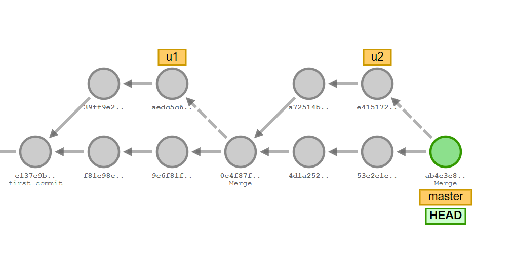

### Collaborating with Git

---

#### So Far

1. git clone
2. git commit
3. git push

---

#### Git Branching

+++

- `git branch <branch-name>`
- `git checkout <branch-name>`
- `git merge <branch-name>`

+++

`HEAD`

- represents current position

+++

`git branch <branch-name>`

- creates a branch at the current HEAD

+++

`git checkout <branch-name>`

- moves current HEAD to the last commit for the specified branch

+++

`git merge <branch-name>`

- merge all commits from branch to current HEAD

---

### Exercises

+++

+++

+++

---

#### Git Remotes

+++

- `git clone <url>`
- `git push origin <branch>`
- `git fetch origin <branch>`
- `git pull origin <branch>`
- `git checkout --track origin/<branch-name>`

+++

#### Exercise

- init a repo and link to github
- create several branches
- add different code on each branch
- push each branch to origin

+++

- delete your folder
- git clone it
- pull each branch from origin

---

#### Team Collab

1. multiple people can code at once
2. code can be merged from different people
3. can trace who wrote what
4. can fix conflicts

+++

#### Exercise: Phase 1

1. each table pick 1 person as the leader
2. leader creates a new folder
3. leader opens folder in vscode
4. leader runs `git init`
5. leader writes a file (just write some text in it)
6. leader commits and push

+++

#### Exercise: Phase 2

1. one team member pulls, then pushes
2. next team member does it, etc until everyone has done it
3. all team members pull

+++

#### Exercise: Phase 3

1. each team member checks out to a new branch
2. make 2 commits each, push
3. each person goes to github and makes a pull request
4. fix as needed
